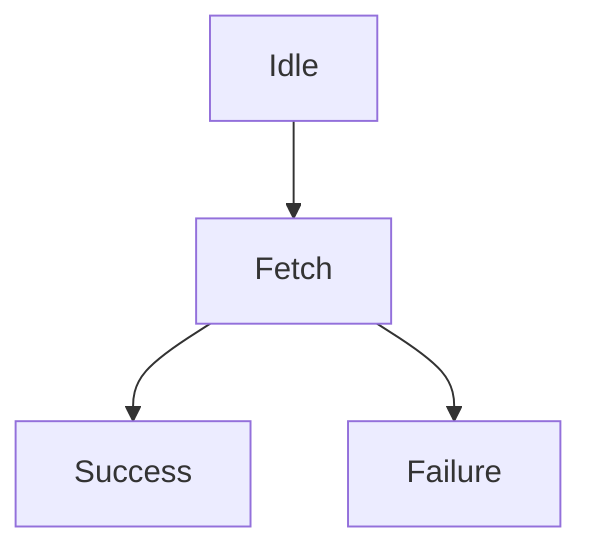
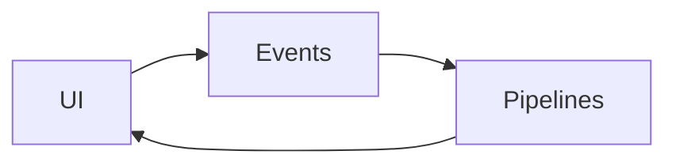
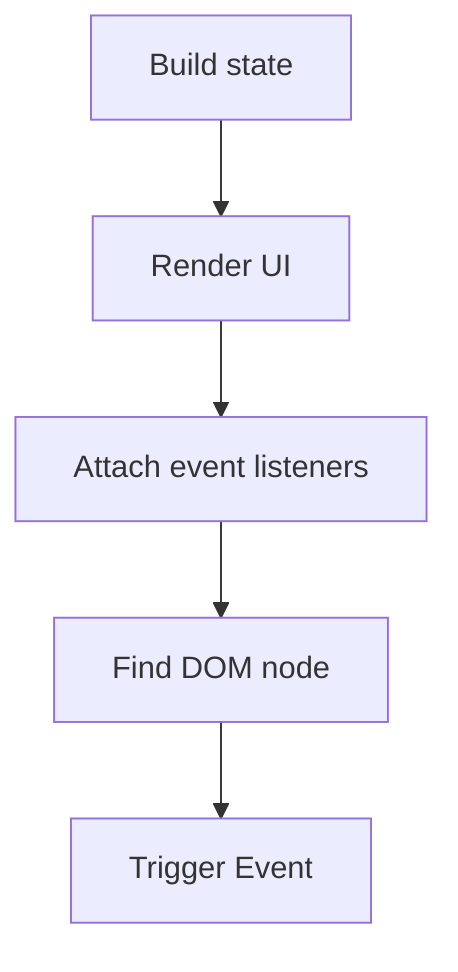
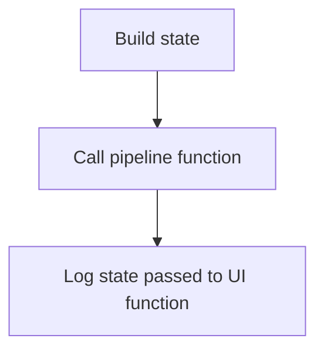

We are going to look at one way of structuring an app to help make your testing life easier.

### The architectural building block

At a high level this is the fundamental rule that we are trying to following the architecture of our application:

```js
const updatePipeline = evt => updateUi(updateState(evt.detail.action))
$el.addEventListener('a-custom-event', updatePipeline);
```

or in a proposed pipeline style:

```js
const updatePipeline = evt =>
  evt.detail.action
  |> updateState
  |> updateUi

$el.addEventListener('a-custom-event', updatePipeline);
```

Lets break down what is happening above: we start with an event, that calls the `updatePipeline` function. The `updatePipeline` function starts by taking some data from the event and updating the state.

This can follow a reducer pattern `state -> action -> state`. We have and initial state, we pass in our action and we get a new state at out the other side.

Once the state is updated, we then update our UI with the new state. This can be done by hand, and sometimes that is the best approach. In most circumstance this is where a state driven declarative UI library or framework should be used (As of writing this I would recommend Preact, lit-html, Svelte or HyperHTML as high quality **light** approaches).

### What this looks like

At it's core there are three packages that makeup the application, with other packages and modules having important roles. A UI update module, that is responsible for taking the state and updating the UI based on the state. Generally there needs to be a DOM element to bind the UI too. The signature of this function should look something like `DOMElement -> State -> void` The function would not return anything but the side-effect would be an updated UI.

The next module would be the for the "pipeline" functions. This is where the core of the work happens. Generally I would say two dependencies are required. First the update UI function and the second a library for the remote calls. The advantage of having these 2 dependencies is the ability to mock them out and leaving you with more deterministic tests. A pipeline function could be responsible for multiple updates to the UI; imagine the fetchUser pipeline:



The single pipeline function can transition through each state change of the fetch request and update the UI as required.

The final core package is the event listener binder. This package is for managing the delegated event listeners. Binding a single event listener to a higher level DOM node and then calling the appropriate pipeline function when the event has been determined and cleaned. This package will have a dependency on the pipeline package.

The cycle is an `Event` triggers a `Pipeline` which updates the `UI`, which has events attached to it.



### What you need to test

For tests like this to work you require some way of rendering DOM elements. My general go to is Jest with JSDOM, but tools for doing this are numerous.


### Testing the UI

The purpose of the UI tests is to make sure that when the UI is updated with a state the correct DOM is produced. The tests for the UI package consist of rendering the UI and seeing if the DOM contains the expected elements. The setup would be:

graph TD
State[Build state] --> Render
Render[Render UI] --> Find
Find[Find DOM node]

then the expectation would be:

```js
expect(foundDOMNode).not.toBeUndefined();
```

If you make your UI driven entirely from the state, it makes this style of test very easy. With the UI frameworks that derive what changes to the UI that need to be made based on the state this helps create a very pure version of your UI.

### Testing the events

The purpose of the event listeners is to call the correct function when an event is dispatched. This is what will be testing: The test is setup by:



Out expectation for this test is that the correct pipeline function will be triggered and we can use our mocked version of the pipeline package to test against that.

```js
expect(mockPipeline).toBeCalled();
```

We can expand this test to make sure the mock pipeline function is called with the correct values, that the events are being parsed properly. That bubbling is occurring as expected. With these examples the foundation of the test remains the same.

### Testing the pipelines

The purpose of the pipeline is to trigger UI changes with the latest version of the state. We call the pipeline function with mocked UI and fetch functions, this allows us to log the state changes that are sent to the UI function.



We then expect:

```js
const firstCallToUi = mockUI.mock.called[0][0]
expect(firstCallToUi.value).toBe(expectedValue);
```

This way we are testing the state changes, the potential paths through the pipeline and multiple state updates in the pipeline.

### Obvious testing

Bending your architecture to testing is one way you can make testing easier, more obvious and more likely to happen. With the approach above I think you have a clean separation of roles that can compose together at a component level up to an application level.
